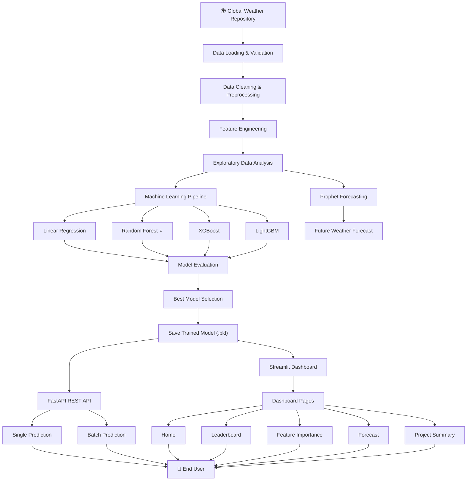

# 🌦️ WeatherTrendAI

> **End-to-End Data Science & Machine Learning Platform for Weather Forecasting, Predictive Analytics, and Interactive Visualization**

<p align="center">

[](https://www.python.org/)
[](https://pandas.pydata.org/)
[](https://numpy.org/)
[](https://scikit-learn.org/)
[]()
[](https://xgboost.ai/)
[](https://lightgbm.readthedocs.io/)
[](https://facebook.github.io/prophet/)
[](https://fastapi.tiangolo.com/)
[](https://streamlit.io/)
[](https://plotly.com/)
[](https://pytest.org/)
[](https://github.com/features/actions)
[](LICENSE)

</p>

---

## 🎥 Project Demo

https://github.com/user-attachments/assets/9bad1632-44f3-4888-8b7c-54a956ee6731

---

# 📖 Overview

**WeatherTrendAI** is an end-to-end **Data Science and Machine Learning platform** developed as an independent personal project. The platform analyzes historical weather data, identifies meaningful patterns, predicts future weather conditions, and visualizes insights through an interactive dashboard and REST API.

The project covers the complete machine learning lifecycle:

**Data → Preprocessing → Feature Engineering → Model Training → Evaluation → Forecasting → API → Interactive Dashboard**

WeatherTrendAI combines practical machine learning experimentation with production-oriented software engineering. Multiple regression models are trained and compared, time-series forecasting is performed using Prophet, predictions are exposed through FastAPI, and results are explored through an interactive Streamlit dashboard.

---

# 🎯 Project Goals

The goal of WeatherTrendAI is to explore how machine learning models can be integrated into a complete software application for weather prediction and analytics.

Key objectives include:

* Building a reproducible data processing pipeline
* Performing exploratory data analysis
* Engineering meaningful weather-related features
* Training and comparing multiple machine learning models
* Evaluating models using standard regression metrics
* Forecasting future weather trends
* Serving predictions through a REST API
* Creating an interactive dashboard for model exploration
* Supporting batch prediction workflows
* Implementing automated testing and CI

---

# ✨ Features

## 🔬 Data Science

* Data loading and validation
* Data preprocessing and cleaning
* Missing value handling
* Duplicate detection and removal
* Exploratory Data Analysis
* Weather trend analysis
* Feature engineering
* Feature importance visualization

## 🤖 Machine Learning

* Linear Regression baseline model
* Random Forest regression
* XGBoost benchmarking
* LightGBM benchmarking
* Model comparison and leaderboard
* Temperature prediction
* Prophet time-series forecasting
* Model evaluation using MAE, RMSE, and R²

## ⚙️ Software Engineering

* FastAPI REST API
* Interactive Streamlit dashboard
* Single prediction
* Batch CSV prediction
* Model leaderboard
* Feature importance analysis
* Weather forecasting visualization
* Automated testing with Pytest
* Continuous Integration with GitHub Actions

---

# 📊 Project Highlights

| Category          | Details                                             |
| ----------------- | --------------------------------------------------- |
| **Dataset**       | Global Weather Repository                           |
| **Records**       | **151,047+**                                        |
| **ML Models**     | Linear Regression, Random Forest, XGBoost, LightGBM |
| **Forecasting**   | Prophet Time-Series Forecasting                     |
| **Best Model**    | Random Forest Regressor                             |
| **Best R² Score** | **0.9506**                                          |
| **Backend**       | FastAPI REST API                                    |
| **Frontend**      | Streamlit Dashboard                                 |
| **Testing**       | Pytest                                              |
| **CI/CD**         | GitHub Actions                                      |

---

# 🏗️ Project Architecture



---

# 🔄 Machine Learning Pipeline

WeatherTrendAI follows a structured end-to-end machine learning workflow.

## 1. Data Loading & Validation

The pipeline begins by loading the **Global Weather Repository** dataset and validating its structure before processing.

## 2. Data Preprocessing

The preprocessing stage includes:

* Handling missing values
* Removing duplicate records
* Cleaning raw weather data
* Preparing structured data for modeling

## 3. Feature Engineering

The following weather-related features are used in the prediction pipeline:

* Humidity
* Pressure
* Wind Speed
* Precipitation
* Cloud Coverage
* Visibility
* UV Index
* PM2.5
* PM10
* Temperature Difference
* Air Quality Score
* Weather Severity
* Year
* Month
* Day
* Hour

## 4. Model Training

Multiple regression models are trained and compared to identify the best-performing approach for temperature prediction.

## 5. Model Evaluation

Each model is evaluated using:

* **MAE — Mean Absolute Error**
* **RMSE — Root Mean Squared Error**
* **R² Score**

## 6. Time-Series Forecasting

Prophet is used to analyze historical temperature patterns and forecast future weather trends.

## 7. Model Deployment

The trained model is integrated with:

* **FastAPI** for REST-based predictions
* **Streamlit** for interactive visualization and user workflows

---

# 🧠 Machine Learning Models

| Model                       | Purpose                         |
| --------------------------- | ------------------------------- |
| **Linear Regression**       | Baseline model                  |
| **Random Forest Regressor** | Final prediction model          |
| **XGBoost Regressor**       | Gradient boosting model         |
| **LightGBM Regressor**      | High-performance boosting model |
| **Prophet**                 | Time-series forecasting         |

---

# 📈 Model Performance

| Model             |       MAE |      RMSE |   R² Score |
| ----------------- | --------: | --------: | ---------: |
| **Random Forest** | **1.224** | **2.124** | **0.9506** |
| XGBoost           |     1.534 |     2.334 |     0.9403 |
| LightGBM          |     1.569 |     2.341 |     0.9399 |
| Linear Regression |     4.278 |     5.904 |     0.6181 |

### 🏆 Best Performing Model

**Random Forest Regressor**

The Random Forest model achieved the strongest overall performance among the evaluated regression models with an **R² score of 0.9506**.

---

# 📊 Dataset

**Dataset:** Global Weather Repository

The dataset contains historical weather information collected from cities around the world.

Key data attributes include:

* Temperature
* Humidity
* Pressure
* Wind Speed
* Visibility
* UV Index
* Air Quality
* Cloud Coverage
* Precipitation
* Date and time information

The dataset is used for machine learning model training, weather analysis, and time-series forecasting.

---

# 🖥️ Interactive Dashboard

WeatherTrendAI includes an interactive **Streamlit dashboard** for exploring model performance, generating predictions, and visualizing weather trends.

## Dashboard Pages

* 🏠 Home
* 🌡️ Single Prediction
* 📂 Batch Prediction
* 🏆 Model Leaderboard
* 📊 Feature Importance
* 📈 Weather Forecast
* 📄 Project Summary

## Dashboard Capabilities

Users can:

* Predict weather temperature for a single sample
* Upload CSV files for batch predictions
* Compare machine learning model performance
* View the model leaderboard
* Explore feature importance
* Visualize future weather forecasts
* Review methodology and project results

---

# 🔌 REST API

WeatherTrendAI provides a **FastAPI REST API** for serving machine learning predictions.

## Available Endpoints

| Method | Endpoint   | Description                       |
| ------ | ---------- | --------------------------------- |
| `GET`  | `/`        | Project and API information       |
| `GET`  | `/health`  | Application health check          |
| `POST` | `/predict` | Generate a temperature prediction |

Interactive API documentation is available at:

```text
http://localhost:8000/docs
```

---

# 🧪 Testing

The project includes automated tests using **Pytest**.

Current test coverage includes:

* Dataset validation
* Dataset loading
* Model availability
* Prediction functionality

Run all tests:

```bash
python -m pytest tests/
```

---

# 🔄 CI/CD

WeatherTrendAI uses **GitHub Actions** to automate continuous integration.

The CI workflow helps verify project quality by running automated checks during development and repository updates.

---

# 📂 Project Structure

```text
WeatherTrendAI/
│
├── .github/
│   └── workflows/
│       └── ci.yml                  # GitHub Actions CI pipeline
│
├── app/
│   ├── __init__.py
│   └── main.py                     # ML training pipeline entry point
│
├── config/
│   ├── settings.py                 # Project configuration
│   └── __init__.py
│
├── dashboard/
│   ├── Home.py                     # Dashboard home page
│   ├── bootstrap.py                # Project path setup
│   │
│   ├── components/
│   │   ├── charts.py
│   │   ├── footer.py
│   │   ├── header.py
│   │   ├── metrics.py
│   │   └── tables.py
│   │
│   └── pages/
│       ├── 1_Single_Prediction.py
│       ├── 2_Batch_Prediction.py
│       ├── 3_Model_Leaderboard.py
│       ├── 4_Feature_Importance.py
│       ├── 5_Forecast.py
│       └── 6_Project_Summary.py
│
├── data/
│   ├── raw/                        # Original dataset
│   └── processed/                  # Cleaned dataset
│
├── docs/
│   ├── screenshots/                # Dashboard screenshots
│   ├── report.pdf                  # Project report
│   └── presentation.pptx           # Project presentation
│
├── outputs/
│   ├── models/
│   │   └── best_model.pkl          # Trained Random Forest model
│   │
│   ├── predictions/
│   │   └── prophet_forecast.csv
│   │
│   ├── reports/
│   │   └── summary.txt
│   │
│   └── results/
│       ├── leaderboard.csv
│       └── feature_importance.csv
│
├── src/
│   ├── api/
│   │   ├── app.py
│   │   ├── routes.py
│   │   ├── schemas.py
│   │   ├── service.py
│   │   └── dependencies.py
│   │
│   ├── data/
│   │   ├── data_loader.py
│   │   └── preprocessing.py
│   │
│   ├── features/
│   │   └── feature_engineering.py
│   │
│   ├── models/
│   │   ├── train.py
│   │   ├── predict.py
│   │   ├── evaluate.py
│   │   └── ensemble.py
│   │
│   ├── pipeline/
│   │   ├── training_pipeline.py
│   │   └── prediction_pipeline.py
│   │
│   ├── utils/
│   │   ├── io.py
│   │   ├── logger.py
│   │   └── helpers.py
│   │
│   └── visualization/
│       └── plots.py
│
├── tests/
│   └── test_pipeline.py
│
├── requirements.txt
├── requirements-dev.txt
├── LICENSE
└── README.md
```

---

# ⚙️ Installation

## 1. Clone the Repository

```bash
git clone https://github.com/ns-niam/WeatherTrendAI.git

cd WeatherTrendAI
```

## 2. Create a Virtual Environment

```bash
python -m venv .venv
```

## 3. Activate the Virtual Environment

### Linux / macOS

```bash
source .venv/bin/activate
```

### Windows

```powershell
.venv\Scripts\activate
```

## 4. Install Dependencies

```bash
pip install -r requirements.txt
```

---

# ▶️ Running the Project

## Train Models

```bash
python -m app.main
```

## Launch FastAPI

```bash
uvicorn api:app --reload
```

Open:

```text
http://127.0.0.1:8000/docs
```

## Launch Streamlit Dashboard

```bash
streamlit run dashboard/Home.py
```

## Run Tests

```bash
python -m pytest tests/
```

---

# 📸 Dashboard Screenshots

## 🏠 Home Dashboard

Provides an overview of the project, model performance, and navigation to all dashboard pages.


---

## 🌡️ Single Prediction

Predict weather temperature using manually entered weather parameters.


---

## 📂 Batch Prediction

Upload a CSV file and generate predictions for multiple weather records.


---

## 🏆 Model Leaderboard

Compare the performance of all machine learning models using evaluation metrics.


---

## 📊 Feature Importance

Visualize the contribution of each feature used by the Random Forest model.


---

## 📈 Weather Forecast

Forecast future weather trends using the Prophet time-series forecasting model.


---

## 📄 Project Summary

Displays the final project summary, methodology, and key findings.


---

# 📊 Results & Key Insights

## 🏆 Model Performance

* **Best Model:** Random Forest Regressor
* **Best R² Score:** **0.9506**
* **MAE:** **1.224**
* **RMSE:** **2.124**

## 💡 Key Insights

* Random Forest achieved the highest prediction accuracy among all evaluated models.
* XGBoost and LightGBM also demonstrated strong performance with competitive R² scores.
* Feature engineering contributed significantly to model performance.
* Prophet captured temporal patterns for future weather forecasting.
* Air quality, humidity, pressure, and temperature-related features were among the most influential predictors.

---

# 🔮 Future Improvements

Potential future enhancements include:

* Deep learning models such as LSTM and Transformer architectures
* Real-time weather API integration
* Docker containerization
* Cloud deployment
* Interactive weather maps
* Model monitoring
* Automatic model retraining
* User authentication
* Project analytics
* Multi-city forecasting
* Expanded automated test coverage
* Experiment tracking and model versioning

---

# 👨‍💻 Author

**Md. Sha Niamatullah (NS Niam)**

AI & Machine Learning Engineering Student
Independent AI & Software Projects

* GitHub: https://github.com/ns-niam
* LinkedIn: https://www.linkedin.com/in/md-sha-niamatullah
* Email: [ns.niam.official@gmail.com](mailto:ns.niam.official@gmail.com)

---

# 📄 License

This project is licensed under the **MIT License**. See the [LICENSE](LICENSE) file for more information.

---

<p align="center">

Built independently by **Md. Sha Niamatullah** using Python, Machine Learning, FastAPI, Streamlit, and modern data science tools.

**WeatherTrendAI — Independent Personal Project**

</p>
