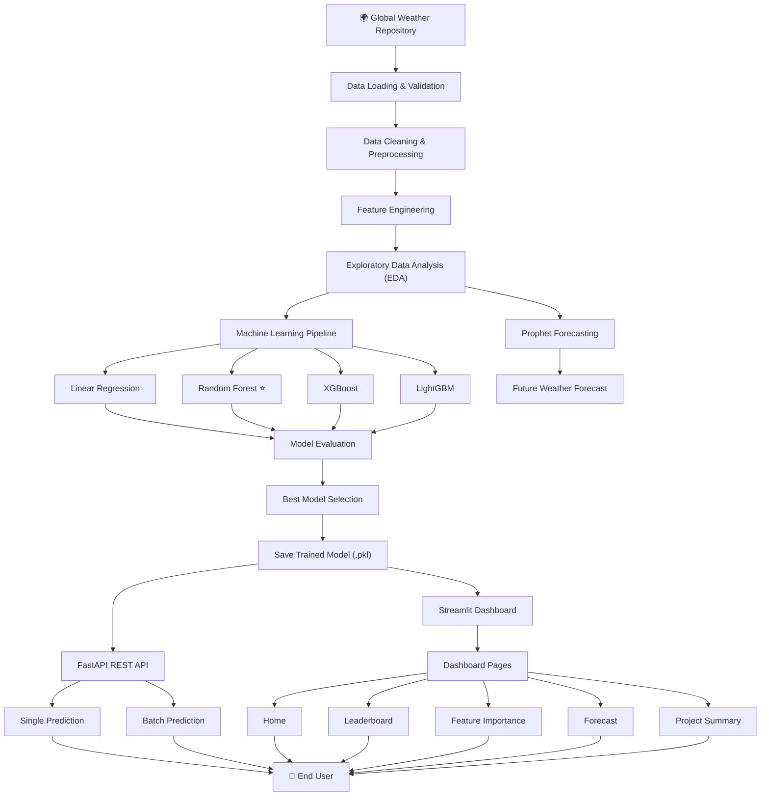

# 🌦️ WeatherTrendAI

> **End-to-End Data Science & Machine Learning Platform for Weather Forecasting, Predictive Analytics, and Interactive Visualization.**

<p align="center">

[](https://www.python.org/)
[](https://pandas.pydata.org/)
[](https://numpy.org/)
[](https://scikit-learn.org/)
[]()
[](https://xgboost.ai/)
[](https://lightgbm.readthedocs.io/)
[](https://facebook.github.io/prophet/)
[](https://fastapi.tiangolo.com/)
[](https://streamlit.io/)
[](https://plotly.com/)
[](https://pytest.org/)
[](https://github.com/features/actions)
[](LICENSE)

</p>

---

## 🎥 Project Demo

> **Watch the complete project walkthrough and live demonstration.**

📺 **Demo Video:**  


---

##  Project Overview

WeatherTrendAI is an end-to-end **Data Science and Machine Learning** platform that analyzes historical weather data, discovers meaningful patterns, predicts future weather conditions, and visualizes insights through an interactive dashboard and REST API.

The project demonstrates the complete data science lifecycle—from data acquisition and preprocessing to feature engineering, predictive modeling, forecasting, evaluation, and deployment.

##  Project Highlights

| Category | Details |
|----------|---------|
|  Dataset | Global Weather Repository |
|  Records | **151,047+** |
|  ML Models | Linear Regression, Random Forest, XGBoost, LightGBM |
|  Forecasting | Prophet Time-Series Forecasting |
|  Best Model | Random Forest Regressor |
|  Best R² Score | **0.9506** |
|  Backend | FastAPI REST API |
|  Frontend | Streamlit Dashboard |
|  Testing | Pytest |
| 🔄 CI/CD | GitHub Actions |

This project was developed as part of the **PM Accelerator AI Engineering Technical Assessment**.

---

##  Features

###  Data Science

- Data preprocessing and cleaning
- Exploratory Data Analysis (EDA)
- Feature engineering
- Weather trend analysis
- Feature importance visualization

###  Machine Learning

- Multiple regression model comparison
- Random Forest temperature prediction
- XGBoost & LightGBM benchmarking
- Prophet time-series forecasting
- Model evaluation using MAE, RMSE, and R²

###  Software Engineering

- FastAPI REST API
- Interactive Streamlit Dashboard
- Single prediction
- Batch CSV prediction
- Model leaderboard
- Automated testing with Pytest
- GitHub Actions CI


##  Project Architecture




## 📂 Project Structure

```text
WeatherTrendAI/
│
├── .github/
│   └── workflows/
│       └── ci.yml                  # GitHub Actions CI pipeline
│
├── app/
│   ├── __init__.py
│   └── main.py                     # ML training pipeline entry point
│
├── config/
│   ├── settings.py                 # Project configuration
│   └── __init__.py
│
├── dashboard/
│   ├── Home.py                     # Dashboard home page
│   ├── bootstrap.py                # Project path setup
│   ├── components/                 # Reusable dashboard components
│   │   ├── charts.py
│   │   ├── footer.py
│   │   ├── header.py
│   │   ├── metrics.py
│   │   └── tables.py
│   │
│   └── pages/
│       ├── 1_Single_Prediction.py
│       ├── 2_Batch_Prediction.py
│       ├── 3_Model_Leaderboard.py
│       ├── 4_Feature_Importance.py
│       ├── 5_Forecast.py
│       └── 6_Project_Summary.py
│
├── data/
│   ├── raw/                        # Original dataset
│   └── processed/                  # Cleaned dataset
│
├── docs/
│   ├── screenshots/                # Dashboard screenshots
│   ├── report.pdf                  # Project report
│   └── presentation.pptx           # Project presentation
│
├── outputs/
│   ├── models/
│   │   └── best_model.pkl          # Trained Random Forest model
│   ├── predictions/
│   │   └── prophet_forecast.csv
│   ├── reports/
│   │   └── summary.txt
│   └── results/
│       ├── leaderboard.csv
│       └── feature_importance.csv
│
├── src/
│   ├── api/
│   │   ├── app.py
│   │   ├── routes.py
│   │   ├── schemas.py
│   │   ├── service.py
│   │   └── dependencies.py
│   │
│   ├── data/
│   │   ├── data_loader.py
│   │   └── preprocessing.py
│   │
│   ├── features/
│   │   └── feature_engineering.py
│   │
│   ├── models/
│   │   ├── train.py
│   │   ├── predict.py
│   │   ├── evaluate.py
│   │   └── ensemble.py
│   │
│   ├── pipeline/
│   │   ├── training_pipeline.py
│   │   └── prediction_pipeline.py
│   │
│   ├── utils/
│   │   ├── io.py
│   │   ├── logger.py
│   │   └── helpers.py
│   │
│   └── visualization/
│       └── plots.py
│
├── tests/
│   └── test_pipeline.py            # Automated tests
│
├── requirements.txt                # Production dependencies
├── requirements-dev.txt            # Development dependencies
├── LICENSE
└── README.md
```


##  Dataset

**Dataset:** Global Weather Repository

The dataset contains historical weather information collected from cities around the world, including:

- Temperature
- Humidity
- Pressure
- Wind Speed
- Visibility
- UV Index
- Air Quality
- Cloud Coverage
- Precipitation
- Date & Time Information

The dataset was obtained from Kaggle and used for machine learning model training and weather forecasting.


##  Machine Learning Pipeline

The WeatherTrendAI pipeline follows a structured machine learning workflow:

### 1. Data Loading
- Load the Global Weather Repository dataset.
- Validate dataset integrity and structure.

### 2. Data Preprocessing
- Handle missing values.
- Remove duplicate records.
- Prepare clean data for modeling.

### 3. Feature Engineering
The following features were used to train the prediction models:

- Humidity
- Pressure (mb)
- Wind Speed (kph)
- Precipitation (mm)
- Cloud Coverage
- Visibility (km)
- UV Index
- PM2.5
- PM10
- Temperature Difference
- Air Quality Score
- Weather Severity
- Year
- Month
- Day
- Hour

### 4. Model Training
Multiple regression models were trained and compared to identify the best-performing model.

### 5. Model Evaluation
Each model was evaluated using:

- MAE (Mean Absolute Error)
- RMSE (Root Mean Squared Error)
- R² Score

### 6. Forecasting
Facebook Prophet was used to forecast future weather trends based on historical temperature data.

### 7. Deployment
The trained model is served through:

- FastAPI REST API
- Streamlit Interactive Dashboard

## 🧠 Machine Learning Models

The following regression models were implemented and evaluated:

| Model | Purpose |
|--------|----------|
| Linear Regression | Baseline model |
| Random Forest Regressor | Final prediction model |
| XGBoost Regressor | Gradient boosting model |
| LightGBM Regressor | High-performance boosting model |
| Prophet | Time-series forecasting |


## 📈 Model Performance

| Model | MAE | RMSE | R² Score |
|--------|-----:|------:|---------:|
| Random Forest | **1.224** | **2.124** | **0.9506** |
| XGBoost | 1.534 | 2.334 | 0.9403 |
| LightGBM | 1.569 | 2.341 | 0.9399 |
| Linear Regression | 4.278 | 5.904 | 0.6181 |

**Best Performing Model:** Random Forest Regressor


##  Key Results

- Successfully trained and compared four machine learning regression models.
- Achieved an R² score of **0.9506** using Random Forest.
- Built a complete prediction pipeline for weather temperature forecasting.
- Developed an interactive Streamlit dashboard.
- Exposed prediction services using FastAPI.
- Implemented automated testing using Pytest.
- Configured GitHub Actions for Continuous Integration.

##  Interactive Dashboard

The project includes an interactive Streamlit dashboard for exploring model results and making predictions.

### Dashboard Pages

-  Home
-  Single Prediction
-  Batch Prediction
-  Model Leaderboard
-  Feature Importance
-  Weather Forecast
-  Project Summary

The dashboard allows users to:

- Predict weather temperature for a single sample
- Upload CSV files for batch prediction
- Compare machine learning models
- Visualize feature importance
- Explore future weather forecasts
- Review project summary and results

##  REST API

WeatherTrendAI provides a FastAPI REST API for serving machine learning predictions.

### Available Endpoints

| Method | Endpoint | Description |
|---------|----------|-------------|
| GET | `/` | Project information |
| GET | `/health` | Health check |
| POST | `/predict` | Temperature prediction |

Interactive API documentation is available at:

```text
http://localhost:8000/docs
```

## ⚙️ Installation

Clone the repository:

```bash
git clone https://github.com/ns-niam/WeatherTrendAI.git

cd WeatherTrendAI
```

Create a virtual environment:

```bash
python -m venv .venv
```

Activate the virtual environment:

**Linux / macOS**

```bash
source .venv/bin/activate
```

**Windows**

```powershell
.venv\Scripts\activate
```

Install dependencies:

```bash
pip install -r requirements.txt
```

## ▶️ Running the Project

### Train Models

```bash
python -m app.main
```

---

### Launch FastAPI

```bash
uvicorn api:app --reload
```

Open:

```text
http://127.0.0.1:8000/docs
```

---

### Launch Streamlit Dashboard

```bash
streamlit run dashboard/Home.py
```

---

### Run Tests

```bash
python -m pytest tests/
```

## ✅ Testing

The project includes automated tests using **Pytest**.

Current test coverage includes:

- Dataset validation
- Dataset loading
- Model availability
- Prediction functionality

Run all tests:

```bash
python -m pytest tests/
```


docs/
└── screenshots/
    ├── home.png
    ├── single_prediction.png
    ├── batch_prediction.png
    ├── leaderboard.png
    ├── feature_importance.png
    ├── forecast.png
    └── project_summary.png


    ## 📸 Dashboard Screenshots

### 🏠 Home Dashboard

Provides an overview of the project, model performance, and navigation to all dashboard pages.


---

### 🌡️ Single Prediction

Predict weather temperature using manually entered weather parameters.


---

### 📂 Batch Prediction

Upload a CSV file and generate predictions for multiple weather records.


---

### 🏆 Model Leaderboard

Compare the performance of all machine learning models using evaluation metrics.


---

### 📊 Feature Importance

Visualize the contribution of each feature used by the Random Forest model.


---

### 📈 Weather Forecast

Forecast future weather trends using the Prophet time-series forecasting model.


---

### 📄 Project Summary

Displays the final project summary, methodology, and key findings.


## 📊 Results & Key Insights

### Model Performance

- 🏆 **Best Model:** Random Forest Regressor
- 🎯 **Best R² Score:** **0.9506**
- 📉 **MAE:** **1.224**
- 📊 **RMSE:** **2.124**

### Key Insights

- Random Forest achieved the highest prediction accuracy among all evaluated models.
- XGBoost and LightGBM also demonstrated strong performance with competitive R² scores.
- Feature engineering significantly improved model accuracy.
- Prophet successfully captured temporal trends for future weather forecasting.
- Air quality, humidity, pressure, and temperature-related features were among the most influential predictors.

## 🚀 PM Accelerator Mission

This project was developed as part of the **PM Accelerator AI Engineering Technical Assessment**.

PM Accelerator's mission is to empower aspiring AI engineers and product builders through real-world projects, practical experience, and industry-focused learning opportunities.

WeatherTrendAI demonstrates the application of machine learning, software engineering, and data science principles to solve real-world weather forecasting problems.

## 🔮 Future Improvements

Future enhancements for WeatherTrendAI include:

- Deep Learning models (LSTM / Transformer)
- Real-time weather API integration
- Docker containerization
- Cloud deployment
- Interactive weather maps
- Model monitoring and automatic retraining
- User authentication and project analytics
- Multi-city forecasting dashboard


## 👨‍💻 Author

**Md. Sha Niamatullah (NS Niam)**

AI & Machine Learning Engineering Student

- GitHub: https://github.com/ns-niam
- LinkedIn: https://www.linkedin.com/in/md-sha-niamatullah
- Email: ns.niam.official@gmail.com

## 📄 License

This project is licensed under the MIT License. See the [LICENSE](LICENSE) file for more information.
